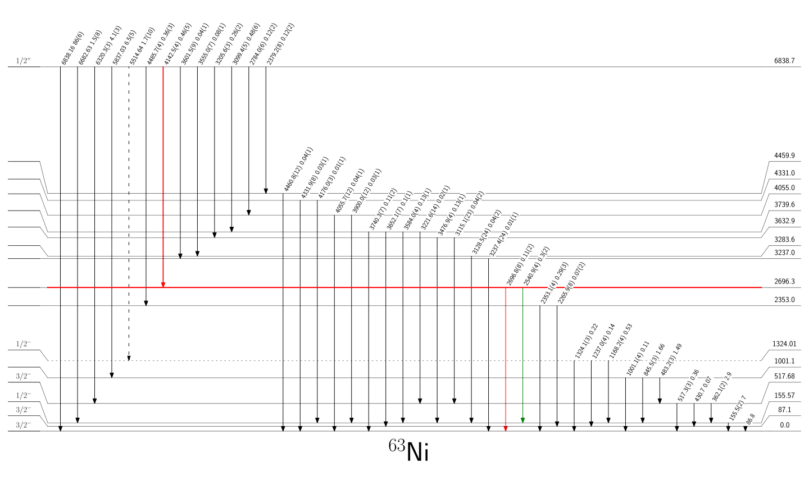

# nice_scheme_plotter

nice_scheme_plotter is the repository dedicated for drawing the schemes of an excited nuclei gamma emissions. 

## Dependencies

nice_scheme_plotter is written in Python 3.6 and it needs following libraries:
* [matplotlib](https://matplotlib.org/) - python plotting library
* [pandas](https://pandas.pydata.org/) - python data analysis library


## Features
The data has to be kept in the .xlsx file (which is recommended) or in two .csv files (one file provides information about excited nuclear levels and second one about gamma transitions).

The program adjust the most of plot properties by itself, but it is also possible to set up all parameters (just like output figure width, or height; picture dpi, font sizes, annotations widths, transitions spacing, etc.).
It is also possible to easily set up some parameters of specific level or transition line. User can change it's color, linewidth or linestyle.

It is also possible to render all captions with LaTex. 



## Levels and transitions data format
At this point (release 1.01) program can recognise following levels properties: level energy, spin value, parity, and lifetime; transition energy, energy uncertainity, from which level it starts, and to which level it goes, transtition intensity, it's uncertainity and transition multipolarity.
**But** the database .xls columns **must** contain two sheets:
1. sheet named ```transitions``` with column names:

    ```I```,	```dI``` , ```g_energy```,	```g_energy_err```,	```from_lvl```,	```to_lvl```, ```lvl_lifetime```
2. sheet named ```levels``` with column names: 

    ```lvl_energy```,	```spin```,	```parity```,	```lifetime```.

**(!)** If you don't have specific parameters for your data just keep these columns (or cells) empty, but don't omitt it's names.


## Example


## Versioning

Realease 1.01 (2018)

## Author
Ewa Adamska

[Ewa.Adamska@fuw.edu.pl](Ewa.Adamska@fuw.edu.pl)


This project is licensed under the MIT License - see the [LICENSE.md](LICENSE.md) file for details
